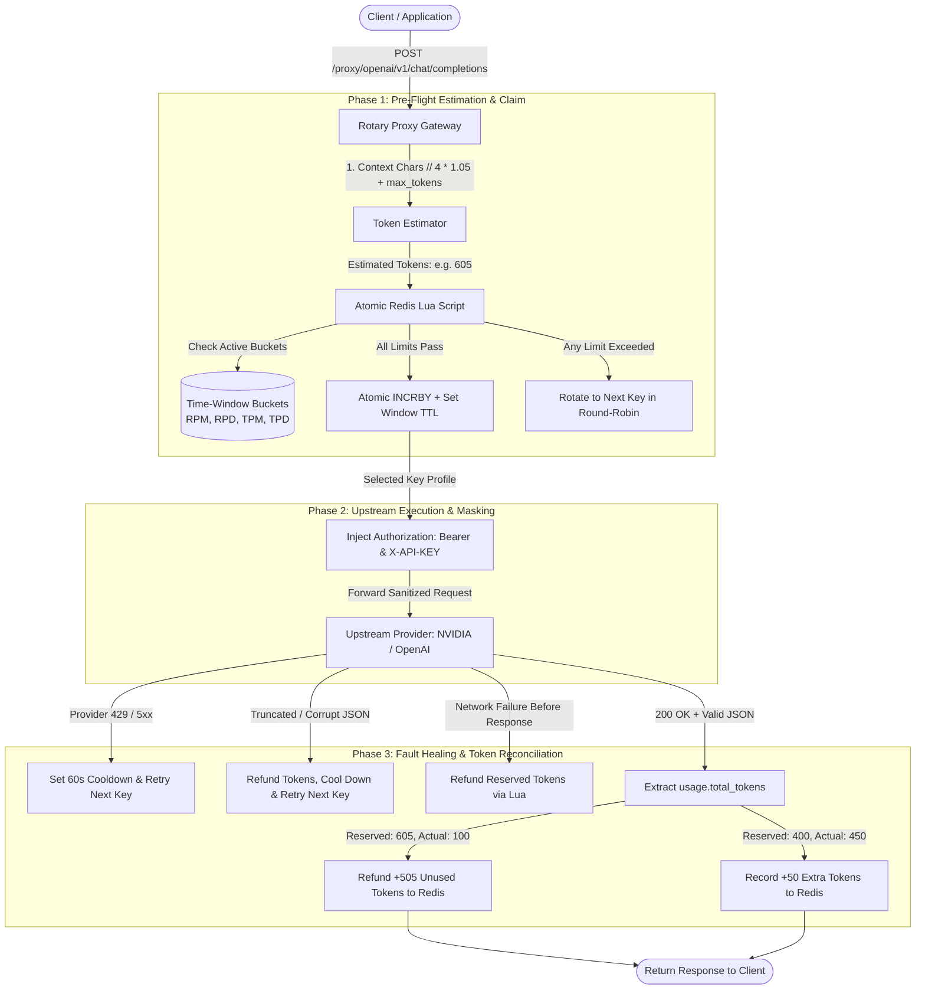

# LLM-Rotry 🔄

[](https://www.python.org/)
[](https://fastapi.tiangolo.com)
[](https://redis.io)
[]()
[](LICENSE)
[](Dockerfile)

**LLM-Rotry** is a high-throughput, production-grade API key rotation engine and reverse proxy gateway designed for LLMs and external search/API providers (OpenAI, NVIDIA NIM, Anthropic, Serper, etc.).

It solves the hard concurrency problems of LLM rate-limiting: **race conditions across parallel workers**, **multi-window quota tracking (RPM, RPD, TPM, TPD)**, **circuit-breaker cooldowns on 429s**, **bidirectional token reconciliation**, and **automatic stream-drop healing**.

---

## 🏗️ Architecture & Request Flow



---

## ⚡ Key Highlights

### 1. Atomic Lua Limit Checks (Zero Race Conditions)
Traditional limiters perform `GET` then `SET`, causing race conditions when parallel requests arrive at the same millisecond. LLM-Rotry checks **all** configured limits (RPM, RPD, RPMON, TPM, TPD, TPMON) inside a **single, indivisible Redis Lua script**. If any limit is exceeded, nothing is modified; if all pass, counters increment atomically.

### 2. Time-Window Buckets & Automatic Reset (No Cron Jobs)
Counters are stored as time-bucketed keys with self-expiring TTLs:
* **Minute**: `usage:{key_id}:rpm:YYYYMMDDHHMM` (TTL = 105s)
* **Day**: `usage:{key_id}:rpd:YYYYMMDD` (TTL = end of UTC day + 1hr)
* **Month**: `usage:{key_id}:rpmon:YYYYMM` (TTL = 35 days)

When the clock rolls over from `12:10` to `12:11`, a new bucket key is used automatically starting from `0`. The old counter drops out of Redis memory on its own TTL.

### 3. Bidirectional Token Reconciliation
* **Upfront Reservation**: Prompt tokens are estimated locally before dispatching ($\lceil(\text{chars} \div 4.0) \times 1.05\rceil + \text{max\_tokens}$).
* **Post-Call Adjustment**: When the provider responds with `usage.total_tokens`:
  * If actual < reserved $\rightarrow$ unused tokens are refunded to Redis.
  * If actual > reserved $\rightarrow$ additional consumed tokens are added to Redis.
* **Result**: Redis usage counters match real-world provider consumption 100% accurately.

### 4. Circuit Breaker & Automatic Cooldown
* If a provider returns **`429 Too Many Requests`**, the router immediately sets `cooldown:{candidate_key}` with a 60-second TTL.
* Subsequent traffic skips the rate-limited key instantly and uses remaining keys in the pool.
* Once the 60s expires, Redis deletes the cooldown key, welcoming it back into the rotation automatically.

### 5. Incomplete JSON & Gateway Crash Healing
* If upstream connection drops mid-stream, or Cloudflare returns a raw HTML 502/504 error page, the proxy detects `JSONDecodeError`, releases the reserved tokens, cools down the failing key, and **automatically retries with the next candidate key** (up to 3 attempts).

### 6. API Key Security & Masking
* Endpoints like `/proxy/{provider}` strip incoming client credentials and inject the provider's API key server-side. **Secret keys never leave your infrastructure.**

---

## 🚀 Quickstart

### Prerequisites
* Python 3.10+
* Redis 6+ (local or cloud)

### 1. Clone & Install

```bash
git clone https://github.com/your-username/llm-rotry.git
cd llm-rotry

python -m venv .venv
source .venv/bin/activate  # On Windows: .venv\Scripts\activate
pip install -r requirements.txt
```

### 2. Configure Environment

Create `.env` based on `.env.example`:

```env
REDIS_HOST=localhost
REDIS_PORT=6379
REDIS_DB=0
DB_PATH=./keys.db
```

### 3. Run the Server

```bash
# Development
uvicorn src.main:app --reload --port 8000

# Production (Multi-worker Gunicorn)
gunicorn src.main:app -w 4 -k uvicorn.workers.UvicornWorker --bind 0.0.0.0:8000
```

---

## 🐳 Docker Deployment

Run the complete production stack (FastAPI + Redis) in one command:

```bash
docker compose up -d --build
```

---

## 📖 API Documentation

### 1. Smart Proxy Gateway (`POST /proxy/{provider}/{subpath}`)
Transparently routes prompts to any configured LLM or search provider, handling rate limits, tokens, and retries.

```bash
# Example: Calling OpenAI or NVIDIA NIM through the rotary proxy
curl -X POST "http://localhost:8000/proxy/openai/v1/chat/completions" \
     -H "Content-Type: application/json" \
     -d '{
       "model": "gpt-4o",
       "messages": [{"role": "user", "content": "Explain quantum computing in simple terms."}],
       "max_tokens": 500
     }'
```

```bash
# Example: Calling Serper Google Search
curl -X POST "http://localhost:8000/proxy/serper" \
     -H "Content-Type: application/json" \
     -d '{
       "q": "fastapi redis rate limiter"
     }'
```

---

### 2. Direct Key Vending (`GET /acquire/{provider}`)
For internal microservices that manage their own HTTP requests and simply require a working, non-exhausted API key:

```bash
curl -X GET "http://localhost:8000/acquire/openai?tokens=500"
```

**Response (200 OK):**
```json
{
  "provider": "openai",
  "api_key": "sk-proj-abc123xyz..."
}
```

**Exhausted Response (429 Too Many Requests):**
```json
{
  "detail": "All keys for provider 'openai' are currently exhausted or in cooldown."
}
```

---

### 3. Key Management API (`/keys`)
CRUD endpoints to register, update, activate, and deactivate provider keys.

| Method | Endpoint | Description |
|---|---|---|
| `POST` | `/keys/new_reg` | Register one or multiple API keys with rate limits |
| `GET` | `/keys` | List all keys (filter by `provider` or `status`) |
| `GET` | `/keys/{key_id}` | Retrieve specific key configuration |
| `PATCH` | `/keys/{key_id}` | Update limits (RPM, RPD, TPM, TPD) or metadata |
| `DELETE` | `/keys/{key_id}` | Delete a specific key |
| `POST` | `/keys/{key_id}/activate` | Set key status to `active` |
| `POST` | `/keys/{key_id}/deactivate` | Set key status to `inactive` |

---

## 🧪 Test Suite (29/29 Passing)

The project includes an extensive test suite covering standard integration workflows and complex distributed edge cases across 5 specialized categories:

```bash
conda activate rag
python -m pytest -v
```

### Test Coverage Categories:
1. **Concurrency & Boundary Quota Exhaustion**: Exact 3/3 boundary consumption, zero RPM configuration, negative token rejection, unlimited key behavior.
2. **Multi-Tier Window Precedence & Rollover**: RPD blocking when RPM has headroom, TPM blocking when RPM has headroom, UTC midnight rollover with cumulative monthly persistence.
3. **Token Estimation & Asymmetric Reconciliation**: Multimodal content part parsing, empty body fallbacks, bidirectional token refunds and increments.
4. **Circuit Breaker & Cooldown Mechanics**: Automatic failover to healthy keys when a sibling key is in cooldown, graceful handling when all keys are cooling down.
5. **Upstream Network Faults & Error Healing**: 503 gateway error handling, empty 200 OK body detection, truncated JSON mid-stream retry.

```text
collected 29 items

test/test_api_endpoints.py ........                                      [ 27%]
test/test_edge_cases.py ..............                                   [ 75%]
test/test_get_key.py .......                                             [100%]

======================== 29 passed, 1 warning in 1.18s =========================
```

---

## 📄 License

Distributed under the MIT License. See [LICENSE](LICENSE) for details.
